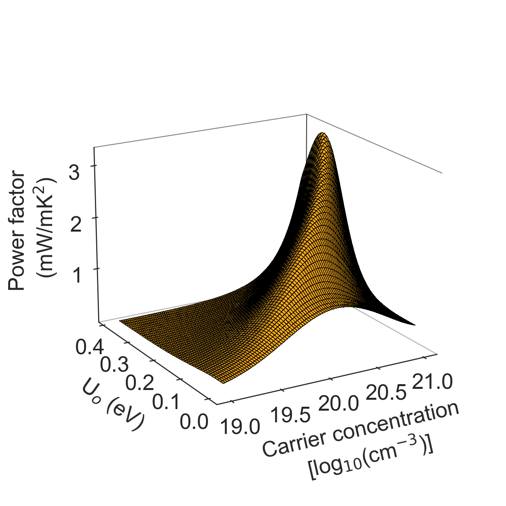

## The Enhancement to Thermoelectric Performance That Could Be Obtained by Designing the Electron Scattering to Optimally Harness the Mechanism of Electron Energy Filtering

  

The central concept of energy filtering is to provide sources of scattering that selectively impede low energy electrons so as to increase Δ1 by reshaping product χ(E,T)τ(E,T) so that it is more strongly asymmetric about the fermi energy. For ideal or perfect filtering a high rate of additional scattering would be applied to all the electrons with energy lower than a certain threshold, Uo so as to reduce their drift velocity to zero. The calculated change in the room temperature power factor (σS2) of *n*-doped silicon that would be provided by with ideal filtering is plotted here as a function of filtering threshold, Uo, and carrier concentration (the details of this calculation are explained in the manual). The key result of this calculation is that if one can control the filtering threshold, the best power performance is to be found at high carrier concentration — ideal filtering breaks the conventional wisdom that there is a carrier concentration that provides the best compromise between conductivity and thermopower to optimize the power factor. It would provide game changing scope for enhancing thermoelectric power factor by exploiting the carrier population in the tail of the Fermi distribution. 

 

## Required data files

The required data files are available to download from Datafile director. Here is the list of the files: 

- EIGENVAL
- DOSCAR
- fermi_integral

