## Design the Nanoscale Morphology of a Thermoelectric to Obtain Favorable Electron Scattering

  

This is an example that shows how to use *thermoelectric.py* to compute electrical properties of Si-based composite containing nanoscale SiC particles is studied.

## Required data files

The required data files are available to download from Datafile director. Here is the list of the files: 
  
- ExpData_SiCfrac-0pct_direction-up.txt
- ExpData_SiCfrac-1pct_direction-up.txt
- ExpData_SiCfrac-5pct_direction-down.txt
- ExpData_SiCfrac-5pct_direction-up.txt
- EIGENVAL
- DOSCAR
- f_inc
- f_inc_1pct
- f_inc_direction_down
- f_no_inc

The following figures will be generated  

  

  
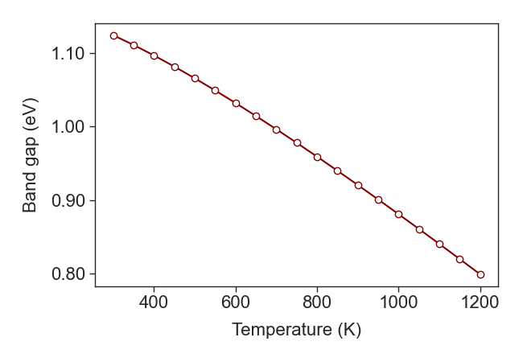 
  
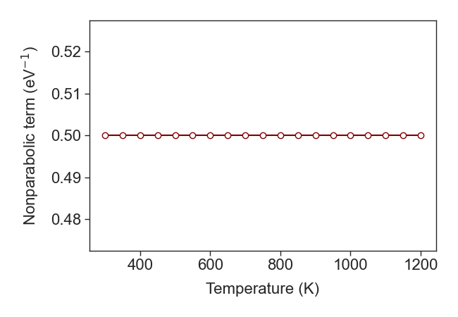 

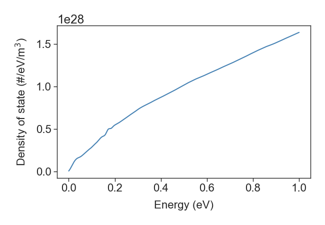 
  
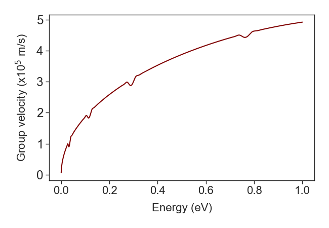 

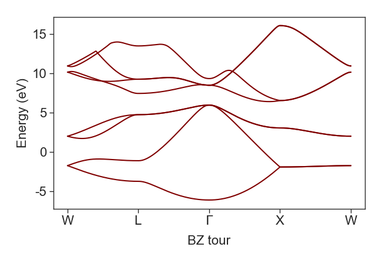 
  
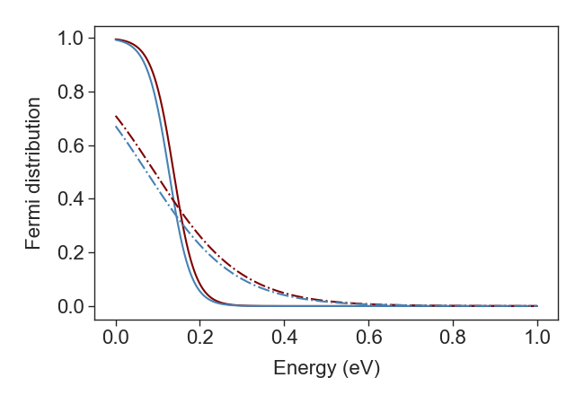 

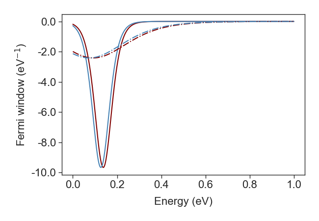 
  
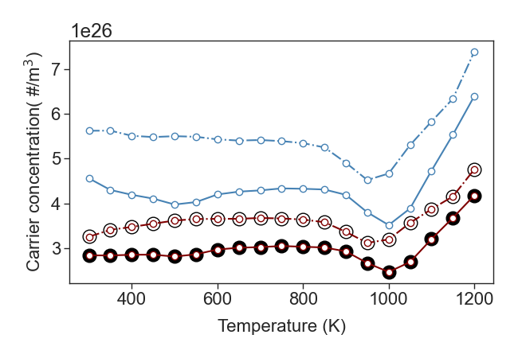 

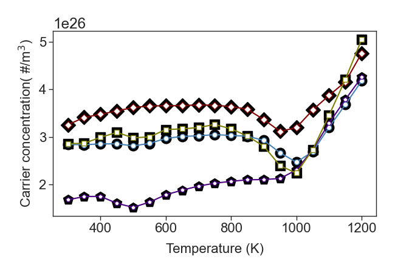 
  
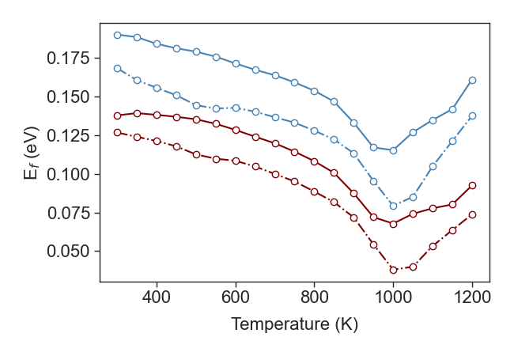 

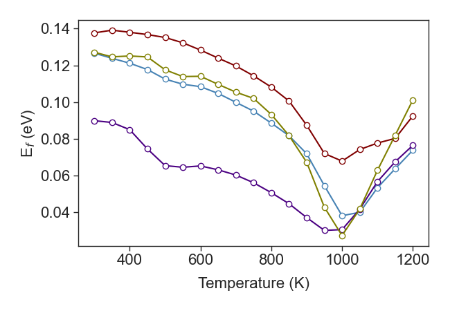 
  
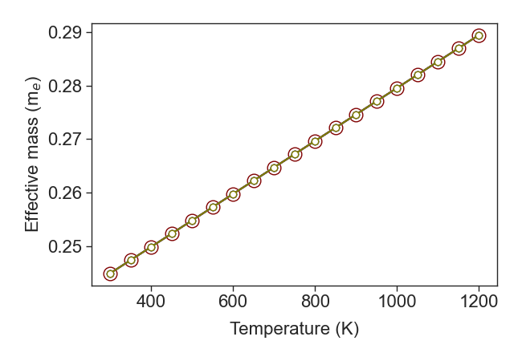 

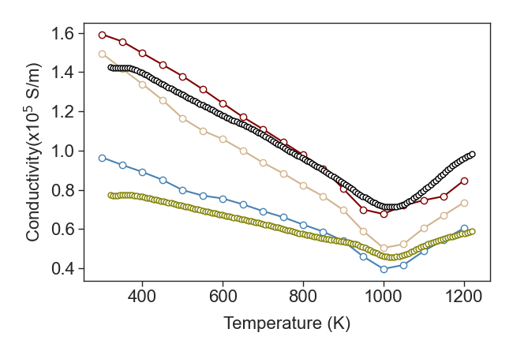 
  
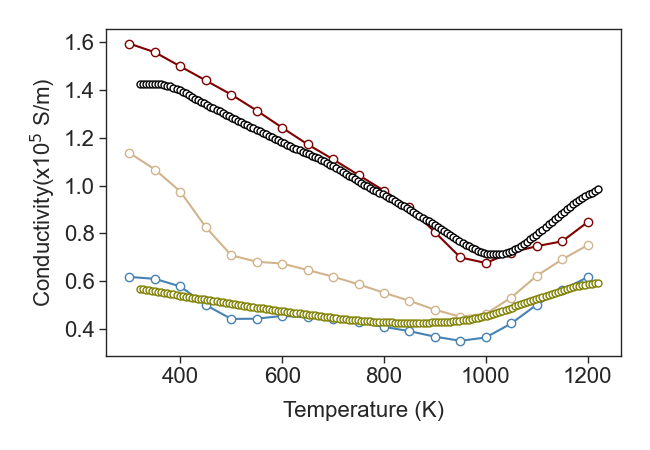 

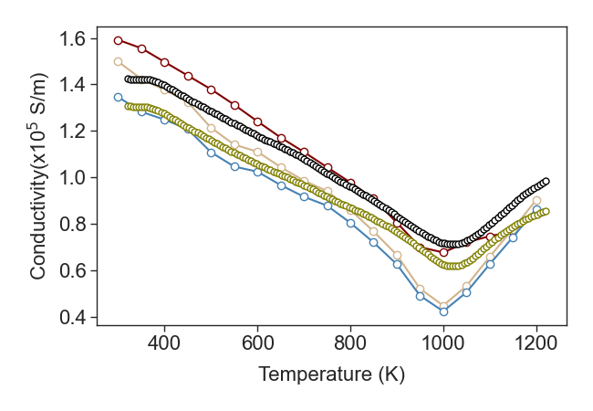 
  
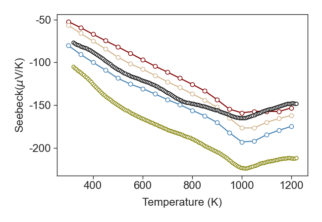 

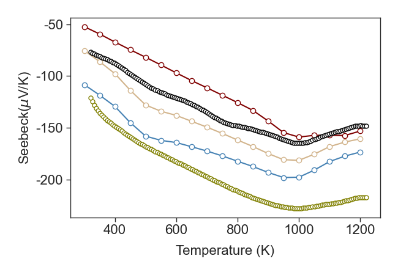 
  
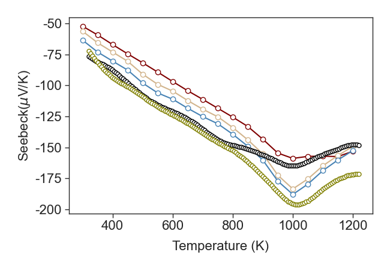 

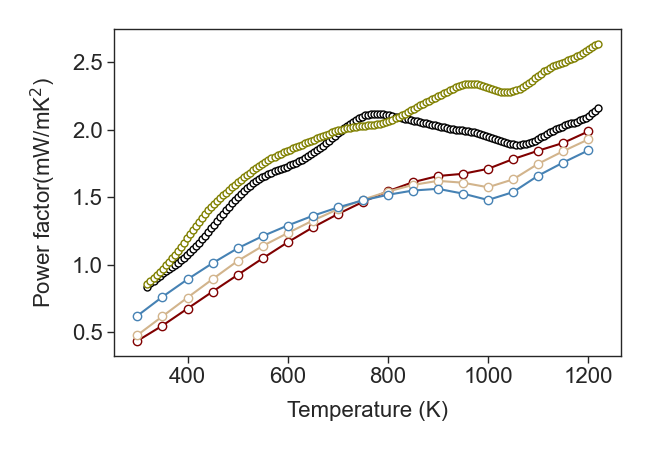 
  
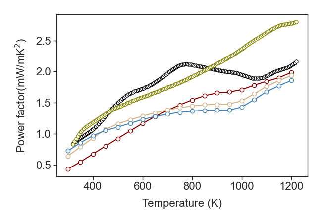 

 
  
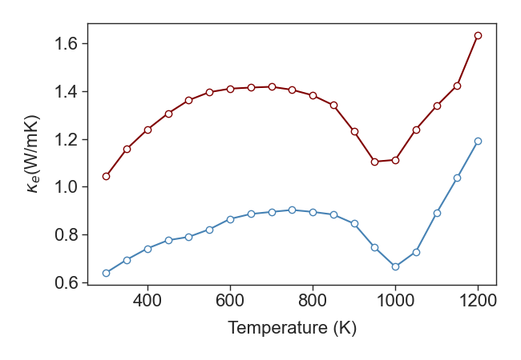 

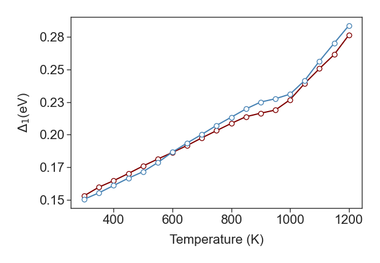 
  
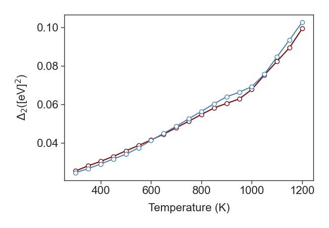 

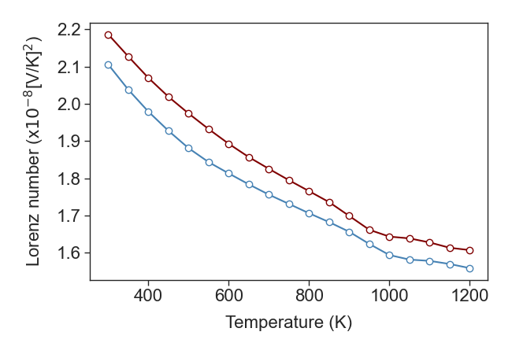 
  
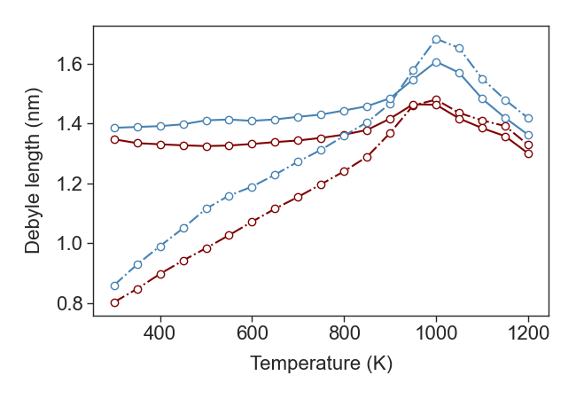 

