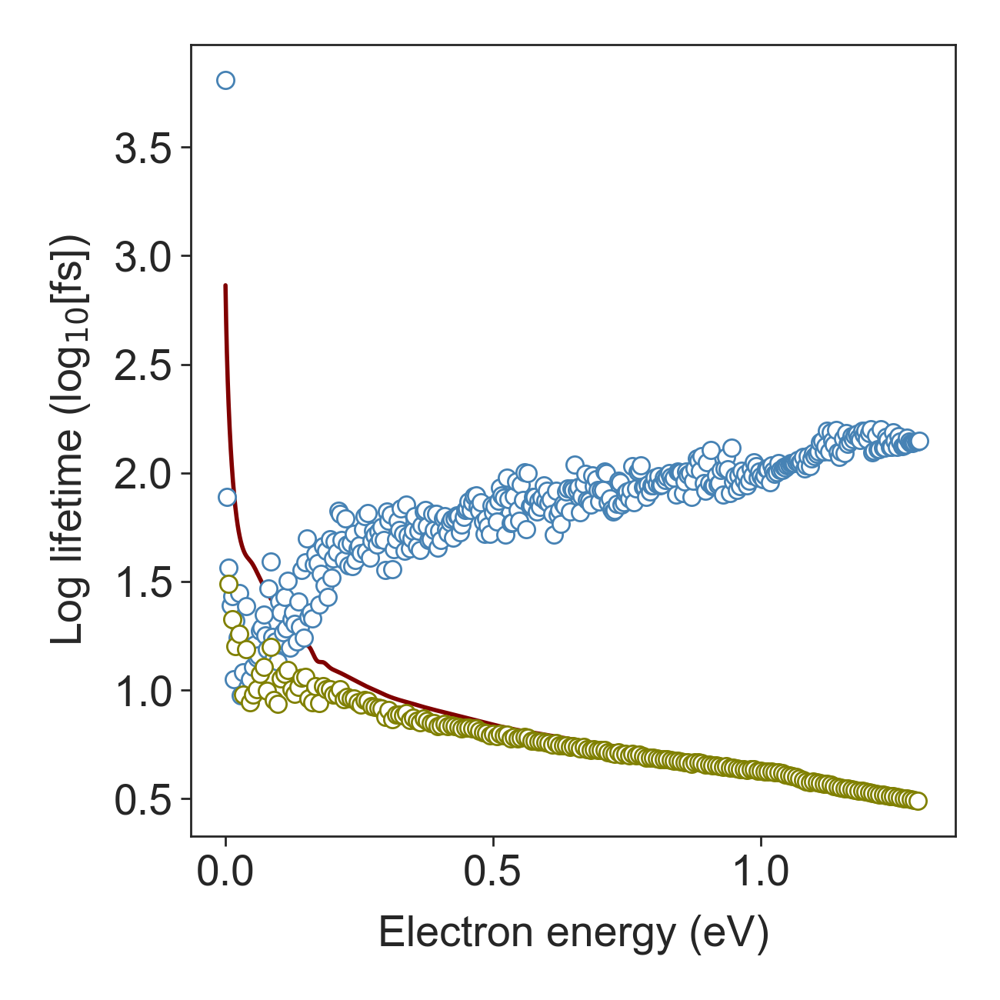

# Themoelectric.py — A Python Tool for Design of High ZT Nanoengineered Thermoelectrics
*Thermoelectric.py* is a computational framework that computes electron transport coefficients with unique features to design the nanoscale morphology of thermoelectrics (TEs) to obtain electron scattering that will enhance thermoelectric performance through electron energy filtering.

- [INSTALLATION](#INSTALATION)
- [THEORY](#THEORY)
  * [MODEL ELECTRON TRANSPORT COEEFICIENTS IN BULK THEMOELECTRICS](#MODEL ELECTRON TRANSPORT COEEFICIENTS IN BULK THEMOELECTRICS)
  * [Model Electron Lifetime](#grid-world-generation-1)
  * [Model Fermi Level](#grid-world-generation-1)
- [CASE STUDY](#CASE STUDY)
  * [Mitigating the Effect of Nanoscale Porosity on Thermoelectric Power Factor of Si](#grid-world-generation-1)
    + [Complete Spec (key, lock, and pit)](#complete-spec--key--lock--and-pit-)
    + [Key Only](#key-only)
    + [Lock and Pit](#lock-and-pit)

- [Citation](#Citation)


# Installation

Compatible with python 3.6 and upwards

```bash
git clone https://github.com/LeroyChristopherDunn/CLGridWorld.git
cd CLGridWorld
pip install -e .
```


# Theory
<div align="justify">
Thermoelectrics (TE) are a class of materials that convert heat directly into electricity. If made sufficiently efficient and inexpensive, these materials could be used to recapturing low-grade waste heat from industrial process as useful electrical energy. The potential energy savings this are vast. Recent studies have suggested that recuperating only 10% of heat lost into electricity can improve fuel energy efficiency by 20% while other studies has reported that more than 68% of U.S. energy consumption escaped as waste heat. My studies have sought strategies to make energy harvesting more efficient by using nanoengineering to improve the performance of TEs.
 
The performance of TE materials at a given temperature, 𝑇, is quantified by a dimensionless figure of merit ZT=(σS<sup>2</sup>)/κ T, where κ, σ and S are the material’s thermal conductivity, electrical conductivity and Seebeck coefficient, respectively. The power factor (σS<sup>2</sup>) in ZT depends on a combination of strongly interdependent electrical transport properties, that have a countervailing dependence of the charge carrier concentration. The tradeoff of these parameters is well understood, and it has become an accepted truth that optimal TE performance can only be obtained in semiconductors that are highly doped to a narrow window of optimized charge carrier concentration. 

My design tool, thermoelectric.py, consists of a series of sub tools that model the thermal and electrical transport properties that contribute to ZT. The design tool was initially developed to model Si based thermoelectric nanocomposites developed in the Mangolini group that have a carefully engineered nanostructure to enhance both the thermal and electrical contributions to ZT. My tool was validated against these experimental measurements and was able to successfully predict the thermoelectric coefficients in Si across a wide range of temperatures. 

Since validating thermoelectric.py I have applied it to the design of thermoelectric materials in two  ways: In my first design process I explored the enhancement to thermoelectric performance that could be obtained by designing the electron scattering to optimally harness the mechanism of electron energy filtering (a mechanism to improve ZT by impeding low energy electrons). Remarkably, I found that using electron energy filtering can completely free engineers from the established paradigm that the optimal carrier concentration is constrained and that only semiconductors can make good thermoelectrics. The model demonstrates that if one applies perfect energy filtering then one can obtain greatly enhanced power factor by doping the material to push the Fermi energy even deep into the conduction band. In fact, it is possible to make TE with optimal performance that are metallic!

My second design study using thermoelectric.py focused on how to design the nanoscale morphology of a thermoelectric to obtain favorable electron scattering. For this I extended my thermoelectric.py tool with a module to compute the quantum mechanically predicted rates of electron scattering from heterogeneities with a variety of different geometries. Most recently I have applied it for the optimal design of porosity.
One currently very active area research in TEs is to engineer materials to contain nanoscale porosity. These impede heat transport and can dramatically increase ZT by reducing the denominator κ; However, porosity also impedes electrical transport, reducing the thermoelectric power factor, σS<sup>2</sup>, in the numerator of ZT. I have used thermoelectric.py to find design strategies to this problem.

I have found that the detrimental effect of pores can be largely mitigated in the thermoelectric design by subtly tuning the doping concentration to higher carrier concentration compared to bulk materials. I have surveyed different shape and size of pores and shown that as a design strategy, for the largest enhancement in Seebeck one needs to get in pores of any shape, if you can make them as small as possible. I have shown that in a n-type thermoelectric the highest practical filtering threshold that can be provided by a dispersion of spherical nanopores with characteristic length around 16 nm giving a theoretical maximum power factor as high as 89% of the maximum power factor that can be obtained in bulk Si at room temperature. The results presented in this study form a complementary design principle for optimizing the electrical transport properties in nanoengineered thermoelectrics.

</div>

## MODEL ELECTRON TRANSPORT COEEFICIENTS IN BULK THEMOELECTRICS
<div align="justify">
<p>The electrical transport properties that appear in ZT can be derived from the semiclassical Boltzmann transport equation using the single relaxation time approximation. In this model, the electrical conductivity, σ, is written as(σ=-1/3 e<sup>2</sup> ∫χ(E,T)τ(E,T)dE), where e is electron charge, τ(E,T) is momentum relaxation time of electrons with energy E at temperature T in n-doped semiconductors. The kernel χ includes all the intrinsic non-scattering terms and is given by (χ(E,T)= ν(E)<sup>2</sup>∂f(E<sub>f</sub>,E,T)/∂E D(E)). Here E<sub>f</sub> is the Fermi level, ν(E) the carrier group velocity, f(E<sub>f</sub>,E,T) the Fermi-Dirac distribution, and D(E) is density of states available for charge carriers. The Seebeck coefficient, S, in ZT describes the diffusion of electrons due to temperature gradient and is related to the difference between the average energy at which current flows and the Fermi energy level. In bulk material, with negative charge carrier, the Seebeck coefficient is given by (S=(-k<sub>B</sub>/e)((E<sub>c</sub>-E<sub>f</sub>)/(k<sub>B</sub>T)+δ)), where k<sub>B</sub>, E<sub>c</sub> are Boltzmann constant and conduction band edge, respectively. The dimensionless parameter δ describes how far the average energy of the current carrying electrons is from the conduction band edge. It is defined as δ=Δ<sub>1</sub>/(k<sub>B</sub>T), where Δ<sub>1</sub>=E<sub>σ</sub>-E<sub>c</sub>, and E<sub>σ</sub> is the average energy of the charge carrier weighted by their contribution to electrical conductivity (Δ<sub>n</sub>=(∫χ(E,T)τ(E,T) E<sub>n</sub> dE)/(∫χ(E,T) τ(E,T)dE))
The central concept of energy filtering is to provide sources of scattering that selectively impede low energy electrons so as to increase Δ<sub>1</sub> by reshaping product χ(E,T)  τ(E,T) so that it is more strongly asymmetric about the fermi energy. For ideal or perfect filetring all the electrons with energy lower than a threshold, U<sub>o</sub> would be completely imobalized. The calculated change in the room temperature power factor (σS<sup>2</sup>) of n-doped silicon that would be provided by with ideal filtering is plotted in Figure as a function of filtering threshold, U<sub>o</sub>, and carrier concentration (the detail of this calculation are explained in next section). The key result of this calculation is that if one can control the filtering threshold, the best power performance is to be found at high carreir concentration—ideal filtering breaks the conventional wisdom that there is a carreir concentration that provides the best compromise between condctivity and thermopower to optimize the power factor. It would provid game changing scope for enhancing thermoelectric power factor by exploiting the carreir population in the tail of the Fermi distribution. In this manuscript we examine the electron energy filtering effect provided in Si by nanoscale porous of variouse sizes and shapes. Our study shows while fltering by nanoscale pores are far from the ideal model, they can provide sufficient enhancement in Seebeck to contervail the degraded electrical conductivity, leaving power factor untoughed. In the sections that follow we describe electron scattering from discrete pores with different shapes, and the parameter-free semiclassical model that we use to model n-type Si (and its validation). Then we elucidate the effect of nanopores on extended pores will system size prependicular to transport direction. We conclude the discussion by a breif discussion on Lorenz number and TE performance at high temperature.</p>
   
  
</div>

## Case Study: Si based TE nanocomposite

### Silicon band structure

 
<div align="justify">
<p>The terms D(E), and ν(E) for Si were derived from the conduction band of Si computed with density functional theory (DFT) using the Vienna Ab initio Simulation Package (VASP) using generalized gradient approximation (GGA) with the Perdew-Burke-Erzerhof exchange correlation functional (PBE). Projector augmented wave (PAW) pseudopotentials is used represent the ion cores. The Kohm-Sham wave functions constructed using a planewave basis set with 700 eV energy cutoff. The Brillouin zone was sampled using 12×12×12 Monkhorst-Pack k-point grid. The forces on the atoms minimized to better than 10<sup>-6</sup> eV/Å to relax the Si primitive cell. The electronic band structure used to compute D(E) on a 45×45×45 k-point grid. The group velocity was obtained from the conduction band curvature, ν=1/ℏ|∇<sub>κ</sub> E| along the〈100〉directions on the Γ to X Brillouin zone path.</p>
 
</div>

### Self consistant Fermi level calculation

 
<div align="justify">
  
<p>In P-doped silicon Fermi level depends strongly on the carrier concentration, which varies non-monotonically with temperature as the solubility of the dopant changes. For a given carrier concentration, we used a self-consistent approach to compute E<sub>f</sub> by setting the conduction band edge as the reference frame and computing E<sub>f</sub> that gives the same carrier population in DFT computed band and the given carrier population. This circumvents the problem that DFT underestimates the band gap as the Fermi level is computed self-consistently from the conduction band using the conduction band edge to set the reference frame. In this method Joyce and Dixon approximation of E<sub>f</sub> for degenerate semiconductors ((E<sub>f</sub>-E<sub>c</sub>)/k<sub>B</sub> ≅ln⁡[(n/N<sub>c</sub>)+1/(√8)]n/N<sub>c</sub> -(3/16-√3/9) (n/N<sub>c</sub>)<sup>2</sup>) is used as the initial guess. The E<sub>f</sub> iterates to meet the relation between charge density and density of state, n=∫<sub>E<sub>c</sub></sub>D(E)f(E)dE.</p>

 

</div>

### Electron lifetime
<div align="justify">

<p>Semiconductor thermoelectrics are generally doped to beyond their saturation level (supersaturate solutions). In these materials, strongly screened Columbic force induced by ionized impurities is the main source of scattering. The transition rate between initial and final energy states has S(E<sub>i</sub>,E<sub>f</sub>)=(2πN<sub>i</sub> e<sup>4</sup> L<sub>D</sub><sup>4</sup>)/((4πϵϵ_o )<sup>2</sup>ℏΩ)δ(E<sub>f</sub>-E<sub>i</sub>). In this case, the electron lifetime is defined as (τ<sub>im</sub>(E)=ℏ/(πN<sub>i</sub>((e<sup>2</sup> L<sub>D</sub><sup>2</sup>)/(4πϵϵ<sub>o</sub>))<sup>2</sup>^2 D(E)). For the strongly screened Columbic potential L<sub>D</sub> is small so that 1/(L<sub>D</sub><sup>4</sup>) is dominant. In nondegenerate semiconductors the Debye length has generalized form of (L<sub>D</sub>=(e<sup>2</sup> N<sub>c</sub>)/(4πϵϵ<sub>o</sub> k<sub>B</sub>T) [F<sub>(-1/2)</sub>(η)+(15αk<sub>B</sub>T)/4 F<sub>(1/2</sub>(η)]), where N<sub>c</sub>=2((m<sub>c</sub> k<sub>B</sub>T)/(2πℏ)<sup>2</sup>)<sup>(3/2)</sup>. While the electron lifetime in equation serves reasonably well for many semiconductors, one should note two shortcomings of the Born approximation failures for slow moving electrons in Coulomb potential and deficiency of simply computing scattering from a single impurity and then multiplying it by number of impurities in capturing interference effects occur as electron wave propagate through random distribution of impurities in deriving this equation. We model the conduction band effective mass variation with temperature using m<sub>c</sub>(T)=m<sub>c</sub><sup>*</sup>(1+5αk<sub>B</sub> T). This model assumes linear dependency on temperature and does not count for degeneracy in high carrier population. A better model that captures dopant concentration needs further study. The second important scattering mechanism specially at high temperature in nonpolar semiconductors like Si is the acoustic phonon deformation potential. For electron phonon interaction, Ravich defined the lifetime as (τ<sub>p</sub>(E)=(ρν<sup>2</sup>ℏ)/(πD<sub>A</sub><sup>2</sup>k<sub>B</sub>TD(E)) {[1-αE/(1+2αE) (1-D<sub>v</sub>/D<sub>A</sub>)]<sup>2</sup>-8/3 αE(1+αE)/(1+2αE)<sup>2</sup> D<sub>v</sub>/D<sub>A</sub>}<sup>(-1)</sup>). This equation accounts for both absorption and emission of phonons. Note that the electron lifetime is strongly dominated by ion scattering and has weak dependency on phonon scattering. The other scattering terms of electron-electron and electron intervalley scattering has negligible importance in determining the electron lifetime and are excluded in calculations without loss of accuracy.</p>

The band bending at the interface of pores presents a large potential energy barrier to electron transport with height, U<sub>o</sub>, equal to the semiconductor’s electron affinity. This potential impedes transport of the low energy electrons while presenting little extra resistance to electrons in high energy states. This scattering, which occurs in addition to the intrinsic scattering from phonons and impurities, changes the electron lifetime by introducing a perturbation potential that for a single pore can be described as U=U<sub>o</sub>∏(r), where, ∏(r) is a dimensionless boxcar function equal to unity inside the pore and zero outside of it. For uniform distribution of pores, the electron momentum relaxation time is defined as (τ<sub>np</sub><sup>(-1)</sup>(s)=N/(8π<sup>3</sup>) ∫SR<sub>kk'</sub>(1-cosθ)dk'), where N, is the number density of pores. This is related to porosity through N=φ/V<sub>pore</sub>, where φ is the porosity and V<sub>pore</sub> is the volume of the pores. The term SR<sub>kk'</sub> in this equation is the probability of transition from an initial state with wave vector k and energy E to a state k’ with energy E'. The (1-cosθ) term accounts for the change in momentum that accompanies this transition, with θ the angel between initial and scattered wavevectors. For a time-invariant potential, the transition rate SR<sub>kk'</sub> is given by Fermi’s golden rule, SR<sub>kk'</sub> = 2π/ℏ (M<sub>kk'</sub> M<sup>+</sup><sub>kk'</sub>)δ(E'-E). In this expression M<sub>kk'</sub> is the matrix element operator that describes the strength of the coupling between initial and final states and the number of ways that the transition between states can occur. For the Bloch waves, M<sub>kk'</sub> is defined as (M<sub>kk'</sub>=∫exp(i(k'-k).r) U(r)dr). For energy conservative (elastic) electron-pore scattering only transmission to eigenstates with the same energy level is possible so the Brillouin zone integral in the equation can be written as a surface integral over the isoenergetic k space contour (τ<sub>np</sub><sup>(-1)</sup>(s)=N/(4π<sup>2</sup> ℏ) ∮<sub>(E(k')=E(k))</sub> (M<sub>kk'</sub> M<sup>+</sup>)/|∇E(k')|  (1-cosθ)dS(k')) where S(k') is the electron isoenergy state for a given wavevector. In most semiconductors isoenergy states close to the conduction valley have ellipsoid shape in momentum space that can be approximates as E(k)=ℏ<sup>2</sup>/2 [(k<sub>x</sub>-k<sub>ox</sub>)<sup>2</sup>/(m<sub>x</sub><sup>o</sup>)+(k<sub>y</sub>-k<sub>oy</sub>)<sup>2</sup>/(m<sub>y</sub><sup>o</sup>)+(k<sub>z</sub>-k<sub>oz</sub>)<sup>2</sup>/(m<sub>z</sub><sup>o</sup>)], where E(k), k<sub>o</sub>=(k<sub>ox</sub>,k<sub>oy</sub>,k<sub>oz</sub>), m<sub>x</sub><sup>o</sup>, m<sub>y</sub><sup>o</sup>, m<sub>z</sub><sup>o</sup> are energy level from conduction band edge, conduction band minimum, effective masses along k<sub>x</sub>, k<sub>y</sub> and k<sub>z</sub>, respectively. For Silicon the conduction band minimum is located at k<sub>o</sub> = 2π/a(0.85,0,0), where a is the lattice parameter equal to 5.43 Å, and m<sub>x</sub><sup>o</sup>= 0.98 m<sub>o</sub>, m<sub>y</sub><sup>o</sup>=m<sub>z</sub><sup>o</sup>=0.19m<sub>o</sub> where m<sub>o</sub> is electron rest mass equal to 9.11×10<sup>-31</sup>kg. In spite of the poor thermoelectric efficiency of bulk silicon due to its high thermal conductivity, it provides an excellent platform for studying the role of design parameters on transport properties, since its bulk properties are extremely well characterized.
Introducing pores into Si will not change the concentration of carrier concentration locally in the remaining Si (nor the Fermi energy), but it will change the volume averaged carrier concentration due to the reduction in the volume averaged density of states. This will impact the conductivity, and thus the effective electrical conductivity of porous materials is modeled as σ<sub>eff</sub>=(1-φ) σ<sub>np</sub>. This change does not affect the Seebeck coefficient since the changes in density of state cancels out for the denominator and numerator of S equation. We assumed that pores do not change the band structure of the Si. This is a reasonable assumption for low porosity, so we limit our study to the pores taking up 5% volume fraction — a level that is still sufficient to reduce the thermal conductivity of Si by an order of magnitude. We assume that electron-pore scattering is independent of the electron-phonon and electron-ion scatterings thus Matthiessen rule can be used to sum the scattering rate from the three processes giving total scattering rate, τ<sup>(-1)</sup>= τ<sub>b</sub><sup>(-1)</sup>+τ<sub>np</sub><sup>(-1)</sup>, where τ<sub>b</sub> is the electron lifetime in bulk Si because of the ionic and phononic scattering terms (τ<sub>b</sub><sup>(-1)</sup>= τ<sub>ion</sub><sup>(-1)</sup>+τ<sub>phonon</sub><sup>(-1)</sup>).

  
 
</div>

### Model prediction for bulk Si
<div align="justify">
  
<p>We have validated the transport model in bulk materials against a set of phosphorous-doped Si. The experimentally measured values are marked with open circles and the solid lines show the prediction of the semiclassical BTE model informed by the experimentally measured carrier population. The model gives a good fit to the experimental data across the full range of temperatures. </p>

 
  
</div> 

### Maximum enhancement in power factor 
<div align="justify">
  
<p> This panel shows the model prediction for the variation in larges achievable TE power factor with carrier concentration in Si based porous materials with optimal characteristic lengths at 300 K. The best power factor performance using ideal filtering model is plotted in green. The power factor in bulk Si is plotted in black. In the narrow carrier concentration window with the highest power factor, bulk Si shows slightly better performance. The large energy difference between the conduction band edge in the Si and the vacuum level in the pore (about 4.15 eV electron affinity of bulk Si) causes strong electron scattering with countervailing response of reduction in the electrical conductivity and enhancement of Seebeck coefficient that cancel out each other, leading to an overall unchanged PF value. The maximum PF in porous structures takes place at carrier concentrations higher than the optimal carrier concentration in bulk Si. This is a key insight for the design of thermoelectrics at room temperature: If one is planning to engineer porous thermoelectrics to reduce phonon conduction, then one should also plan to increase the carrier concentration above the optimal level for the bulk semiconductor. In the Si model the maximum power factor of porous materials takes place at 8×10<sup>19</sup> cm<sup>-3</sup> carrier concentration and is slightly less than the maximum power factor in bulk Si occurs at 6.3x10<sup>19</sup> cm<sup>-3</sup> (~25% increase in doing concentration is needed for the best performance in porous Si).  </p>
 
  
</div> 

# Citation
[1] Mitigating the Effect of Nanoscale Porosity on Thermoelectric Power Factor of Si, Hosseini, S. Aria and Romano, Giuseppe and Greaney, P. Alex, ACS Applied Energy Materials,2021, https://doi.org/10.1021/acsaem.0c02640.


