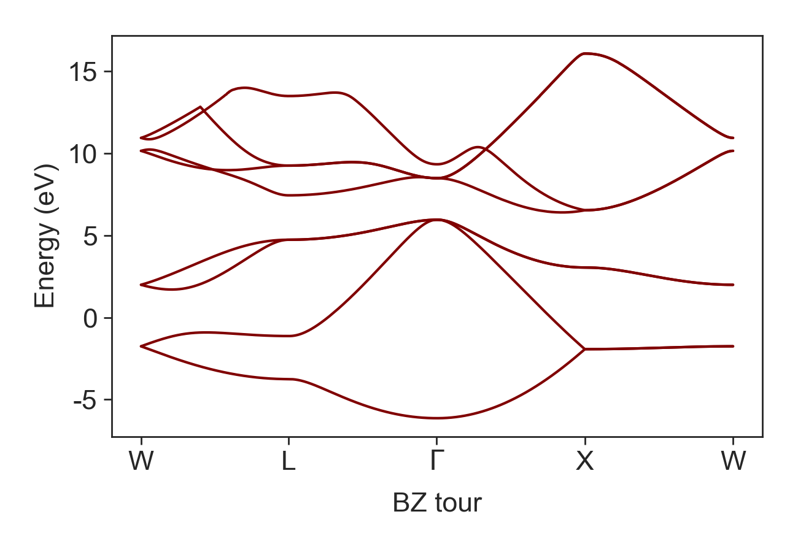

# Themoelectric.py — A python tool for design of high ZT nanoengineered thermoelectrics
<div align="justify">
 
*Thermoelectric.py* is a computational framework that computes electron transport coefficients with unique features to design the nanoscale morphology of thermoelectrics (TEs) to obtain electron scattering that will enhance performance through electron energy filtering. The code uses the semiclassical Boltzmann transport equation to compute the TE properties of electrical conductivity, Seebeck coefficient, electron contribution to thermal conductivity, etc., under relaxation time approximation. The code has an interface with the VASP ab initio simulation package. What distinguishes *Thermoelectric.py* from other software such as *BoltzTrap* is sets of subtools that are implemented assist in modeling electron transport in semiconductors. These include a tool for self-consistent calculation of the Fermi level from a given carrier concentration, and a fast algorithm that uses Fermi’s golden rule to compute the energy dependent electron scattering rate due nanoparticles, pores and grain boundaries. The first of these subtools circumvent the problem that DFT underestimates the band gaps, and the second performs isosurface integrals to enable very dense but numerically efficient Brillouin Zone mesh sampling.
</div>

- [THEORY](#THEORY)
  * [Model Electron Transport Coefficients In Bulk Thermoelectrics](#Model-Electron-Transport-Coefficients-In-Bulk-Thermoelectrics)
  * [Model Fermi Level](#Model-Fermi-Level)
  * [Model Electron Lifetime](#Model-Electron-Lifetime)
  * [Model Electron Transport Coefficients In Nanostructured Thermoelectrics](#Model-Electron-Transport-Coefficients-In-Nanostructured-Thermoelectrics)
- [Case Study Si based TE nanocomposite](#Case-Study-Si-based-TE-nanocomposite)
  * [Silicon band structure](#Silicon-band-structure)
  * [Model prediction for bulk Si](#Model-prediction-for-bulk-Si)
  * [Ideal Electron Filtering](#Ideal-Electron-Filtering)
  * [Effect of Nanopores on Lorenz Number](#Effect-of-Nanopores-on-Lorenz-Number)
- [CITATION](#Citation)


# INSTALLATION

Compatible with python 3.0 and upwards

```bash
git clone https://github.com/...
cd ...
pip install -e .
```


# THEORY

<div align="justify">
 
Thermoelectrics (TE) are a class of materials that convert heat directly into electricity. The performance of TE materials at a given temperature, 𝑇, is quantified by a dimensionless figure of merit ZT=(σS<sup>2</sup>)/κ T, where κ, σ and S are the material’s thermal conductivity, electrical conductivity and Seebeck coefficient, respectively. The power factor (σS<sup>2</sup>) in ZT depends on a combination of strongly interdependent electrical transport properties, that have a countervailing dependence of the charge carrier concentration. The tradeoff of these parameters is well understood, and it has become an accepted truth that optimal TE performance can only be obtained in semiconductors that are highly doped to a narrow window of optimized charge carrier concentration. If made sufficiently efficient and inexpensive, these materials could be used to recapturing low-grade waste heat from industrial process as useful electrical energy. The potential energy savings are vast. Recent studies have suggested that recuperating only 10% of heat lost into electricity can improve fuel energy efficiency by 20% while other studies has reported that more than 68% of U.S. energy consumption escaped as waste heat. 

</div>

## Model Electron Transport Coefficients In Bulk Thermoelectrics

<div align="justify">
 
<p> 
The electrical conductivity and thermopower of a population of independent charge carriers can be derived from the Boltzmann transport equation by integrating the contribution from all carrier states. In an isotropic system where the states can be enumerated by their energy, and using the single relaxation time approximation for the collision operator, these can be written as integrals over the carrier energy, E, so that σ, S, and κ<sub>e</sub> are given by
</p>

<p align="center">

</p>

<p align="center">

</p>

<p align="center">

</p>

<p>
Here the function χ(E,T)= ν(E)<sup>2</sup>∂f(E<sub>f</sub>,E,T)/∂E D(E), lumps together the materials density of carrier states, D(E), and group velocity, ν(E), with the energy derivative of the Fermi-Dirac occupancy, f(E,c,T), where <sub>f</sub> is the Fermi level. The functions γ(E,T)=(E-E<sub>f</sub>)χ(E,T) and ζ(E,T)=(E-E<sub>f</sub>)<sup>2</sup> χ(E,T). These equations also express the relationship between the transport properties and Δ<sub>n</sub>, the moments of the distribution of conductivity over carriers with different energy, defined as </p>

<p align="center">

</p>
The Seebeck coefficient obtains its largest magnitude by maximizing the asymmetry of product Dτν<sup>2</sup> about the Fermi level to move its center of current, Δ<sub>1</sub>, away from the Fermi level.

## Model Fermi Level

| fermiLevelSelfConsistent(self, carrierConcentration, Temp, energyRange, DoS, fermilevel)|
| --------------------------------------------------------------------------------------- |
<div align="justify">
  
<p>
The Fermi level depends strongly on the carrier concentration, which varies non-monotonically with temperature as the solubility of the dopant changes. For a given carrier concentration, a self-consistent approach is developed to compute E<sub>f</sub> by setting the conduction band edge as the reference frame and computing E<sub>f</sub> that gives the same carrier population in DFT computed band and the given carrier population. This circumvents the problem that DFT underestimates the band gap. In this method Joyce and Dixon approximation of E<sub>f</sub> for degenerate semiconductors ((E<sub>f</sub>-E<sub>c</sub>)/k<sub>B</sub> ≅ln⁡[(n/N<sub>c</sub>)+1/(√8)]n/N<sub>c</sub> -(3/16-√3/9) (n/N<sub>c</sub>)<sup>2</sup>) is used as the initial guess. The E<sub>f</sub> iterates to meet the relation between charge density and density of state, n=∫<sub>E<sub>c</sub></sub>D(E)f(E)dE.
</p>

<p align="center">
 
</p>
The experimental measurements are noisy and so for the transport model,  the  carrier  concentration  was  represented  with the continuous smoothing function fit through the experimental data. This panel shows the Bayesian interpolation fitted to the temperature dependence of the experimentally measured carrier concentration.  
 
<p align="center">
 
</p>
In this pane, the Fermi level is plotted for different carrier concentrations using self-consistent method described above.


## Model Electron Lifetime

| tau_Screened_Coulomb(self,energyRange, m_c, LD, N)|
| ------------------------------------------------- |

| tau_Unscreened_Coulomb(self,energyRange, m_c, N)|
| ----------------------------------------------------- |

| tau_Strongly_Screened_Coulomb(self, D, LD, N)|
| ----------------------------------------------------- |

| tau_p(self, energyRange, alpha, Dv, DA, T, vs, D, rho)|
| ----------------------------------------------------- |

| tau_p(self, energyRange, alpha, Dv, DA, T, vs, D, rho)|
| ----------------------------------------------------- |

<div align="justify">

<p>
Semiconductor TEs are generally doped to beyond their saturation level. In these materials, strongly screened Columbic force induced by ionized impurities is the main source of scattering. The transition rate between initial and final energy states has S(E<sub>i</sub>,E<sub>f</sub>)=(2πN<sub>i</sub> e<sup>4</sup> L<sub>D</sub><sup>4</sup>)/((4πϵϵ<sub>o</sub> )<sup>2</sup>ℏΩ)δ(E<sub>f</sub>-E<sub>i</sub>). In this case, the electron lifetime is defined as 
</p>
 
<p align="center">
 
</p>

<p>
For the strongly screened Columbic potential L<sub>D</sub> is small so that 1/(L<sub>D</sub><sup>4</sup>) is dominant. In doped semiconductors the Debye length has generalized form of 
</p>

<p align="center">
 
</p>

<p>
where N<sub>c</sub>=2((m<sub>c</sub> k<sub>B</sub>T)/(2πℏ)<sup>2</sup>)<sup>(3/2)</sup>. While the electron lifetime in equation serves reasonably well for many semiconductors, one should note two shortcomings of the Born approximation failures for slow moving electrons in Coulomb potential and deficiency of simply computing scattering from a single impurity and then multiplying it by number of impurities in capturing interference effects occur as electron wave propagate through random distribution of impurities in deriving this equation. We model the conduction band effective mass variation with temperature using m<sub>c</sub>(T)=m<sub>c</sub><sup>*</sup>(1+5αk<sub>B</sub> T). This model assumes linear dependency on temperature and does not count for degeneracy in high carrier population. 
</p>

<p align="center">
 
</p>

This panel shows the Debye length for two different carrier concentrations. The solid lines show the model prediction using degenerate form while the dash lines are for the cases in which degeneracy is neglected.

<p>
The second important scattering mechanism specially at high temperature in nonpolar semiconductors like Si is the acoustic phonon deformation potential. For electron phonon interaction, Ravich defined the lifetime as 
 
 <p align="center">
 
</p>
 
<p> 
This equation accounts for both absorption and emission of phonons. Note that the electron lifetime is strongly dominated by ion scattering and has weak dependency on phonon scattering. The other scattering terms of electron-electron and electron intervalley scattering has negligible importance in determining the electron lifetime and are excluded in calculations without loss of accuracy.
</p>

<p>
The rate of electron scattering due to the disordered arrangement in alloys dielectrics model as
</p>

 <p align="center">
 
</p>
<p>
where x is the atomic fraction of alloy, a is the lattice parameter and the term U<sub>A</sub> is the alloy scattering potential.
</p>

<p align="center">
 
</p>
<p>
This panel show the magnitude of electrical conductivity and Seebeck coefficient in phosphorus-doped bulk silicon. The solid blue line shows the model prediction for electrical conductivity, and the red line shows the prediction for the Seebeck coefficient. The experimentally measured σ and S are marked with open circles.
</p>

## Model Electron Transport Coefficients In Nanostructured Thermoelectrics
| bandGap(self, Eg_o, Ao, Bo, Temp=None) |
| -------------------------------------- |
| bandGap(self, Eg_o, Ao, Bo, Temp=None) |
| -------------------------------------- |

<p>
In the nanostructured of interest in this study, there are two additional electron scattering processes that arise as a result of the morphology: electron scattering at grain boundaries, and scattering from pores. The rate of electron momentum relaxation due to elastic scattering from a uniform dispersion of pores can be modeled as
</p>

<p align="center">
 
</p>

<p>
Here N is the number density of pores, and the term SR<sub>kk'</sub> is the rate of transition of an electron from an initial state with wave vector k and energy E to a state k' with energy E' due to a single pore. For a time-invariant potential, the transition rate SR is given by Fermi’s golden rule as
</p>

<p align="center">
 
</p>

<p>
where the matrix element operator M describes the strength which the pore couples the initial and final states and the number of ways the transition can occur.  For Bloch waves, M is given by the integral of the overlap of the initial and final state with the pore potential U(r) so that
<p> 

<p align="center">
 
</p>

For energy conservative (elastic) scattering between eigenstates with the same energy equation scattering can be recast as a surface integral over the isoenergetic k-space contour that satisfies E(k')=E(k) 

<p align="center">
 
</p>

<p>
where dS is the incremental area of the isoenergetic k-space surface. In most indirect bandgap semiconductors such as Si, the contours of isoenergy states near to conduction band valley have ellipsoidal shape in momentum space that can be approximated as
</p>

<p align="center">
 
</p>

<p>
The pore potential, U(r), is assumed to be 
</p>

<p align="center">
 
</p>

<p>
where U<sub>o</sub> is the electron affinity. For an infinitely long cylindrical pores with radius r<sub>o</sub>, and aligned with axis parallel to z, this gives the scattering matrix element operator
</p>

<p align="center">
 
</p>

or for the spherical pores/ nanoparticles we have

<p align="center">
 
</p>

<p>
We remark that for nanoparticels the band alignment should be used instead of electron affinity. A similar use of Fermi's Golden rule can be used to model the rate of electron scattering by grain boundaries. Minnich et al have suggested that grain boundaries provide a scattering potential of magnitude U<sub>GB</sub> that decays away from the grain boundary over distance z<sub>o</sub>. From this, they derived the scattering operator matrix element for a small disc of grain boundary with radius r<sub>o</sub> as
</p>

<p align="center">
 
</p>

The electron liftime in Si<sub>0.8</sub>Ge<sub>0.2</sub> due to different scattering terms are shown in the panel below.

<p align="center">
 
</p>

</div>


## Case Study Si based TE nanocomposite

### Silicon band structure

| bandGap(self, Eg_o, Ao, Bo, Temp=None) |
| -------------------------------------- |


<div align="justify">
<p>The terms D(E), and ν(E) for Si were derived from the conduction band of Si computed with density functional theory (DFT) using the Vienna Ab initio Simulation Package (VASP) using generalized gradient approximation (GGA) with the Perdew-Burke-Erzerhof exchange correlation functional (PBE). Projector augmented wave (PAW) pseudopotentials is used represent the ion cores. The Kohm-Sham wave functions constructed using a planewave basis set with 700 eV energy cutoff. The Brillouin zone was sampled using 12×12×12 Monkhorst-Pack k-point grid. The forces on the atoms minimized to better than 10<sup>-6</sup> eV/Å to relax the Si primitive cell. The electronic band structure used to compute D(E) on a 45×45×45 k-point grid. The group velocity was obtained from the conduction band curvature, ν=1/ℏ|∇<sub>κ</sub> E| along the〈100〉directions on the Γ to X Brillouin zone path.</p>
 
<p align="center">
 
</p>
 
<p align="center">
 
</p>
 
</div>

### Model prediction for bulk Si

| bandGap(self, Eg_o, Ao, Bo, Temp=None) |
| -------------------------------------- |


<div align="justify">
  
<p>
shows the variation of highest Seebeck (thermopower) and PF modeled in this study with carrier concentrations for pores with different shapes at 500 K and 1300 K. The bulk properties are shown in solid black lines. 
</p>

<p align="center">
 
</p>

<p align="center">
 
</p>
  
</div> 

### Ideal Electron Filtering

| bandGap(self, Eg_o, Ao, Bo, Temp=None) |
| -------------------------------------- |

For ideal or perfect filtering, a high rate of additional scattering would be applied to all the electrons with energy lower than a certain threshold, Uo, so as to reduce their drift velocity to zero. The calculated change in the room temperature PF of n-doped silicon that would be provided by with ideal
filtering is plotted in Figure 1 as a function of filtering threshold, U , and carrier concentration. The key result of this calculation is that if one can control the filtering threshold, the best power performance is to be found at high carrier.

<p align="center">
 
</p>
  

### Effect of Nanopores on Lorenz Number

| bandGap(self, Eg_o, Ao, Bo, Temp=None) |
| -------------------------------------- |

<div align="justify">
 
When advocating for increased carrier concentration in TEs, it is important to determine whether this will cause a significant increase to the denominator of ZT. Hence, we finish our examination of the effect of pores on the room-temperature electrical transport coefficients by briefly discussing the electronic thermal conductivity (κe). The κe is related to σ by Wiedemann Franz law as κe = LTσ. Here, L is the Lorenz number that conventionally varies from 2 × (kB/e)2 ≈
1.48 × 10−8(V2/K2) up to π2/3 × (kB/e)2 ≈ 2.44 × 10−8(V2/K2) for the low carrier concentration and degenerate (free electron) limit, respectively.
Lorenz number is related to the moments of the charge carriers, Δn, through L = 1/(eT)2(Δ2 −Δ21). In bulk Si, the Lorenz number varies monotonically from
1.53 × 10−8 (V2/K2) at 1019 1/cm3 to 2.39 × 10−8 (V2/K2) at 1021 1/cm3 . Figure 6 shows the variation of Lorenz number The objective of adding porosity is to lower the lattice thermal conductivity, and prior studies by Romano3 and others32 have shown that the lattice thermal conductivity in nanoporous Si with the geometries modeled here can be as low as ∼30 W/m/ K at room temperature. At bulk room temperature, Si with the carrier concentration tuned to optimize ZT, the electronic thermal conductivity is ∼0.3 W/m/Kstill 2 orders of magnitude lower than the lattice conductivity.
  

</div> 

# CITATION
[1] Mitigating the Effect of Nanoscale Porosity on Thermoelectric Power Factor of Si, Hosseini, S. Aria and Romano, Giuseppe and Greaney, P. Alex, ACS Applied Energy Materials,2021, https://doi.org/10.1021/acsaem.0c02640.


