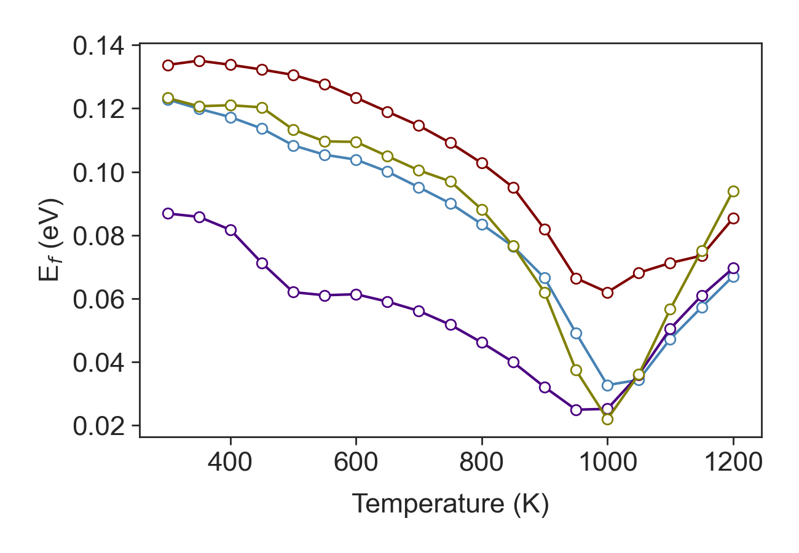

# Themoelectric.py — a Python tool for design of high ZT nanoengineered thermoelectrics

Thermoelectrics (TE) are a class of materials that convert heat directly into electricity. If made sufficiently efficient and inexpensive, these materials could be used to recapturing low-grade waste heat from industrial process as useful electrical energy. The potential energy savings this are vast. Recent studies have suggested that recuperating only 10% of heat lost into electricity can improve fuel energy efficiency by 20% while other studies has reported that more than 68% of U.S. energy consumption escaped as waste heat. My studies have sought strategies to make energy harvesting more efficient by using nanoengineering to improve the performance of TEs. To achieve this, I have developed a python design package called thermoelectric.py for modeling thermoelectric performance.
The performance of TE materials at a given temperature, 𝑇, is quantified by a dimensionless figure of merit ZT=(σS2)/κ T, where κ, σ and S are the material’s thermal conductivity, electrical conductivity and Seebeck coefficient, respectively. The power factor (σS2) in ZT depends on a combination of strongly interdependent electrical transport properties, that have a countervailing dependence of the charge carrier concentration. The tradeoff of these parameters is well understood, and it has become an accepted truth that optimal TE performance can only be obtained in semiconductors that are highly doped to a narrow window of optimized charge carrier concentration. My design tool, thermoelectric.py, consists of a series of sub tools that model the thermal and electrical transport properties that contribute to ZT. The design tool was initially developed to model Si based thermoelectric nanocomposites developed in the Mangolini group that have a carefully engineered nanostructure to enhance both the thermal and electrical contributions to ZT. My tool was validated against these experimental measurements and was able to successfully predict the thermoelectric coefficients in Si across a wide range of temperatures. 
Since validating thermoelectric.py I have applied it to the design of thermoelectric materials in two  ways: In my first design process I explored the enhancement to thermoelectric performance that could be obtained by designing the electron scattering to optimally harness the mechanism of electron energy filtering (a mechanism to improve ZT by impeding low energy electrons). Remarkably, I found that using electron energy filtering can completely free engineers from the established paradigm that the optimal carrier concentration is constrained and that only semiconductors can make good thermoelectrics. The model demonstrates that if one applies perfect energy filtering then one can obtain greatly enhanced power factor by doping the material to push the Fermi energy even deep into the conduction band. In fact, it is possible to make TE with optimal performance that are metallic!
My second design study using thermoelectric.py focused on how to design the nanoscale morphology of a thermoelectric to obtain favorable electron scattering. For this I extended my thermoelectric.py tool with a module to compute the quantum mechanically predicted rates of electron scattering from heterogeneities with a variety of different geometries. Most recently I have applied it for the optimal design of porosity.
One currently very active area research in TEs is to engineer materials to contain nanoscale porosity. These impede heat transport and can dramatically increase ZT by reducing the denominator κ; However, porosity also impedes electrical transport, reducing the thermoelectric power factor, σS2, in the numerator of ZT. I have used thermoelectric.py to find design strategies to this problem. I have found that the detrimental effect of pores can be largely mitigated in the thermoelectric design by subtly tuning the doping concentration to higher carrier concentration compared to bulk materials. I have surveyed different shape and size of pores and shown that as a design strategy, for the largest enhancement in Seebeck one needs to get in pores of any shape, if you can make them as small as possible. I have shown that in a n-type thermoelectric the highest practical filtering threshold that can be provided by a dispersion of spherical nanopores with characteristic length around 16 nm giving a theoretical maximum power factor as high as 89% of the maximum power factor that can be obtained in bulk Si at room temperature. The results presented in this study form a complementary design principle for optimizing the electrical transport properties in nanoengineered thermoelectrics.
My advancements make a significant and novel contribution to the field of TE, showing that the conventional paradigm is overly restrictive, and there are whole other class of materials can be good TE. The thermoelectric.py tools is made available to for public.

## Case Study: Si based TE nanocomposite

### Silicon band structure

 

The terms D(E), and ν(E) for Si were derived from the conduction band of Si computed with density functional theory (DFT) using the Vienna Ab initio Simulation Package (VASP) using generalized gradient approximation (GGA) with the Perdew-Burke-Erzerhof exchange correlation functional (PBE). Projector augmented wave (PAW) pseudopotentials is used represent the ion cores. The Kohm-Sham wave functions constructed using a planewave basis set with 700 eV energy cutoff. The Brillouin zone was sampled using 12×12×12 Monkhorst-Pack k-point grid. The forces on the atoms minimized to better than 10-6 eV/Å to relax the Si primitive cell. The electronic band structure used to compute D(E) on a 45×45×45 k-point grid. The group velocity was obtained from the conduction band curvature, ν=1/ℏ|∇κ E| along the〈100〉directions on the Γ to X Brillouin zone path.

### Self consistant Fermi level calculation

 

  

In P-doped silicon Fermi level depends strongly on the carrier concentration, which varies non-monotonically with temperature as the solubility of the dopant changes. For a given carrier concentration, we used a self-consistent approach to compute Ef by setting the conduction band edge as the reference frame and computing Ef that gives the same carrier population in DFT computed band and the given carrier population. This circumvents the problem that DFT underestimates the band gap as the Fermi level is computed self-consistently from the conduction band using the conduction band edge to set the reference frame. In this method Joyce and Dixon approximation of Ef for degenerate semiconductors ((Ef-Ec)/kB ≅ln⁡[(n/Nc)+1/(√8)]n/Nc -(3/16-√3/9) (n/Nc)2) is used as the initial guess. The Ef iterates to meet the relation between charge density and density of state, n=∫EcD(E)f(E)dE.

 

### Electron lifetime

Semiconductor thermoelectrics are generally doped to beyond their saturation level (supersaturate solutions). In these materials, strongly screened Columbic force induced by ionized impurities is the main source of scattering. The transition rate between initial and final energy states has S(Ei,Ef)=(2πNi e4 LD4)/((4πϵϵ_o )2ℏΩ)δ(Ef-Ei). In this case, the electron lifetime is defined as (τim(E)=ℏ/(πNi((e2 LD2)/(4πϵϵo))2^2 D(E))
For the strongly screened Columbic potential L_D is small so that 1/(L_D^4 ) in equation (…) is pivotal. In nondegenerate semiconductors the Debye length has generalized form of (L_D=(e^2 N_c)/(4πϵϵ_o k_B T) [F_(-1/2) (η)+(15αk_B T)/4 F_(1/2) (η)])
Where N_c=2((m_c k_B T)/〖2πℏ〗^2 )^(3/2). While the electron lifetime in equation serves reasonably well for many semiconductors, one should note two shortcomings of the Born approximation failures for slow moving electrons in Coulomb potential and deficiency of simply computing scattering from a single impurity and then multiplying it by number of impurities in capturing interference effects occur as electron wave propagate through random distribution of impurities in deriving equation (…). We model the conduction band effective mass variation with temperature using m_c (T)=m_c^* (1+5αk_B T). This model assumes linear dependency on temperature and does not count for degeneracy in high carrier population. A better model that captures dopant concentration needs further study.
The second important scattering mechanism specially at high temperature in nonpolar semiconductors like Si is the acoustic phonon deformation potential. For electron phonon interaction, Ravich defined the lifetime as (τ_p (E)=(ρν^2 ℏ)/(πD_A^2 k_B TD(E) ) {[1-αE/(1+2αE) (1-D_v/D_A )]^2-8/3  αE(1+αE)/(1+2αE)^2   D_v/D_A }^(-1))
This equation accounts for both absorption and emission of phonons. Note that the electron lifetime is strongly dominated by ion scattering and has weak dependency on phonon scattering. The other scattering terms of electron-electron and electron intervalley scattering has negligible importance in determining the electron lifetime and are excluded in calculations without loss of accuracy.

