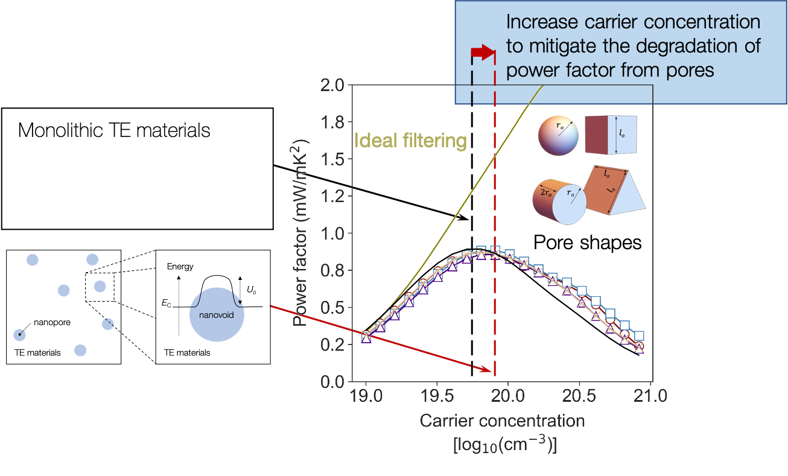
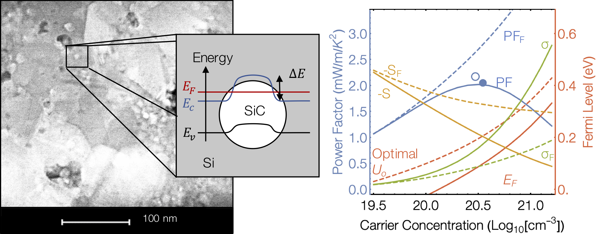

.. ThermoElectric documentation master file, created by
   sphinx-quickstart on Thu Mar 15 13:55:56 2018.
   You can adapt this file completely to your liking, but it should at least
   contain the root `toctree` directive.

ThermoElectric
=========================================================

ThermoElectric is a linear Boltzmann Transport Solver (BTE) solver that computes electronic transport coefficients in
nano-structured materials. ThermoElectric has unique features for designing the nanoscale morphology of thermoelectric
materials to enhance electronic performance through electron energy filtering.

   Mitigate the effect of nanoscale porosity on thermoelectric power factor of Si.

   Enhanced thermoelectric ZT in the tails of the Fermi distribution via electron filtering by nano-inclusions.

Installation
=========================================================
::

   gh repo clone ariahosseini/ThermoElectric
   cd ThermoElectric
   sudo python setup.py install

.. toctree::
   :maxdepth: 2
   :caption: Contents:

   intrinsic_properties
   electron_lifetime
   electrical_properties
   ref
   api

